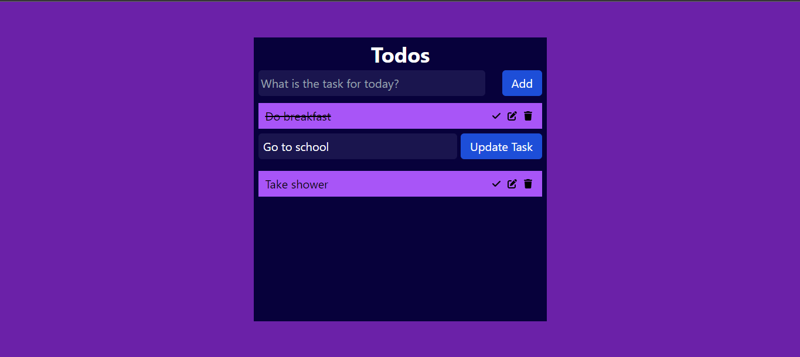

# <a href="https://todoreact04.netlify.app/">Todo App</a>



## Project Overview

In this project, I make a todo app and it is totally responsive.

You can easily add your todo work step by step and you can easily edit, mark as completed and delete using just one click.

## Steps to run this project on your local machine

1. Clone this repository on your local machine.<br>Note: For cloning the repository, You have to install git on your machine. You can download git from here <a href="https://git-scm.com/downloads">https://git-scm.com/downloads</a>. And configure your "username" and "email".<br> Run this command 
```
git clone "https://github.com/HadiRaza04/todo-react.git"
```
2. Then open the command prompt OR Powershell run this below command and hit enter. <br> Note: You have to install Node JS on your machine to run this command. You can download Node JS from here <a href="https://nodejs.org/en/download/current">https://nodejs.org/en/download/current</a>.
```
npm install
```
3. In the last step you have to run the script dev command to run the project.
```
npm run dev
```
4. You can visit "http://localhost:5173/" on your default browser to see the project.
